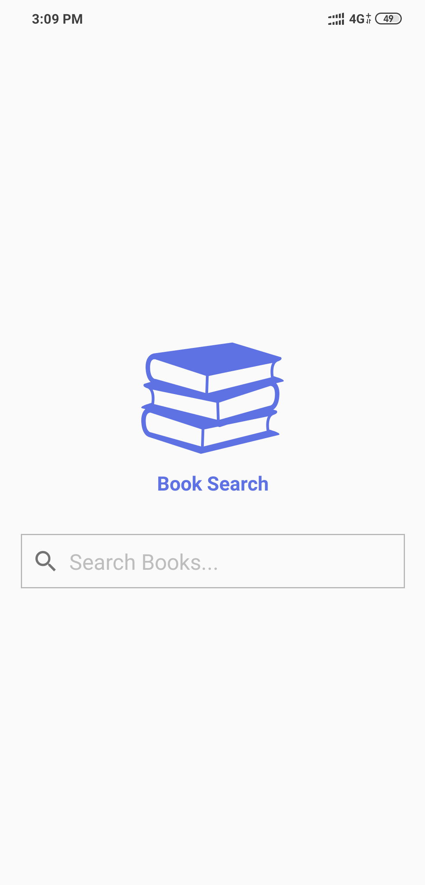
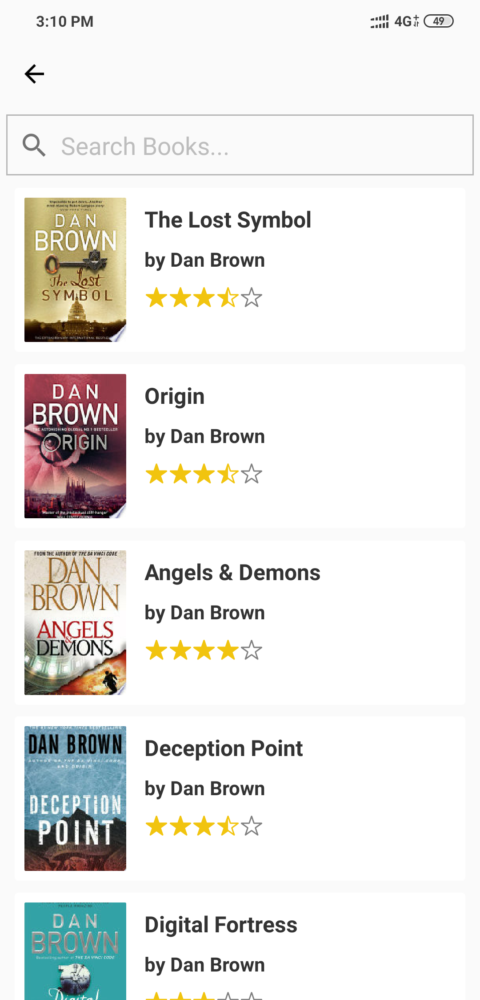

# RN Book Search

A React Native native app built using Expo.

### [Expo Demo Link](https://expo.io/@vikrantnegi/RNBookSearch)

## Features and TODOs

- [x] [Styled Component](https://www.styled-components.com/docs/basics)
- [x] Placeholder components
- [ ] Custom fonts
- [ ] Dark Mode
- [ ] Add Type support (Flow? or Typescript?)
- [ ] Test Cases (Jest?)
- [ ] Error reporting (Bugsnag?)
- [ ] Offline support
- [ ] Add animations

## App Preview

### Video Preview

### ScreenShots

 &nbsp;&nbsp;
 &nbsp;&nbsp;

## Getting Started

1. Install the latest Node
2. Install [Expo](https://expo.io/) - `npm install expo-cli --global`
3. `cd` into this project directory
4. `npm install` or `yarn install`
5. Run `expo start`

## API's Used

- [Google Books APIs](https://developers.google.com/books)

## License

Licensed under the [MIT](https://github.com/vikrantnegi/RN-Book-Search/blob/master/LICENSE).

## Author

[Vikrant Negi](https://vikrantnegi.com/)
